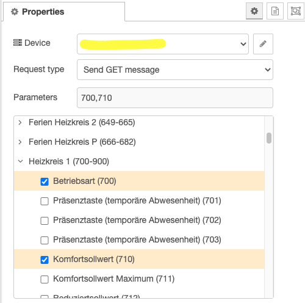

[](https://cla-assistant.io/node-red-contrib/node-red-contrib-bsb-lan)

[](https://www.codefactor.io/repository/github/node-red-contrib/node-red-contrib-bsb-lan)
[](https://badge.fury.io/js/node-red-contrib-bsb-lan)

# node-red-contrib-bsb-lan a BSB-LAN node for Node-RED

Provides functionality to retrieve data from the [BSB-LAN](https://1coderookie.github.io/BSB-LPB-LAN/) adapter.

When triggered, the node will login and make the configured request.

This is an sample request of fetching (GET) two parameters:

``` json
{
    "_msgid": "...",
    "payload": {
        "700": {
            "name": "Betriebsart",
            "error": 0,
            "value": "1",
            "desc": "Automatik",
            "dataType": 1,
            "readonly": 0,
            "unit": ""
        },
        "710": {
            "name": "Komfortsollwert",
            "error": 0,
            "value": "22.0",
            "desc": "",
            "dataType": 0,
            "readonly": 0,
            "unit": "&deg;C"
        }
    }
}
```

# Install

Install via the palette manage in the Node-RED admin ui (no restart needed).

Alternatively run the following command in your Node-RED user directory (typically `~/.node-red`):

```sh
npm install node-red-contrib-bsb-lan
```

then restart Node-RED and add an instance of the bsb-lan node.

# Usage

Just add the connection settings and select what type of request you want to sent.

You can also override the configuration settings with properties that are injected
into the incomig message.

property | type | example
---------|------|--------


## GET

With the GET you can fetch multiple parameters in on request.
Just select in the parameters tree the parameter that you like to
fetch and inject a message.



The payload will be filled with the values.

## SET / INF

You can even change the configuration of your device but you have to
first enable in the BSB-LAN the write functionality
[see Chapter 5](https://1coderookie.github.io/BSB-LPB-LAN_EN/chap05.html)

Select the right request type and now you can select only one
value from the parameter list.
Fill in the value that you want to write into the parameter and
inject a message.
